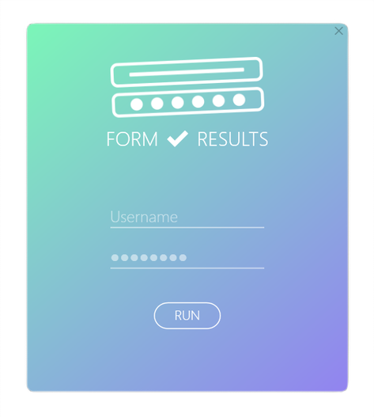
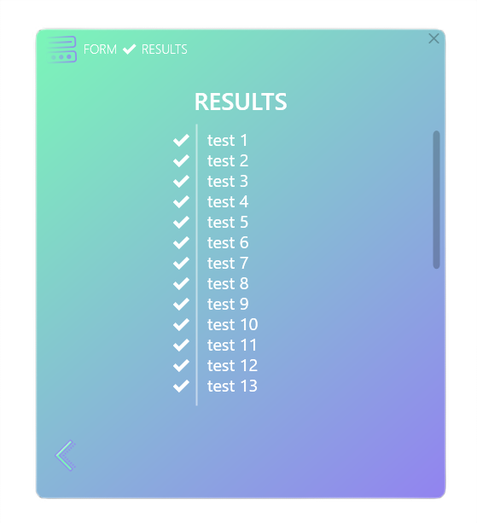

# Form to Results
The purpose of this is to provide a reusable GUI for a simple 'take input -> return results' type of tool, that you might usually just make a console app for.

This makes it significantly friendlier to use for anyone using the tool, and a bit more pleasant to look at. Whilst having it built already in a reusable form means it takes little extra effort to implement.

What you end up with, is something like...

